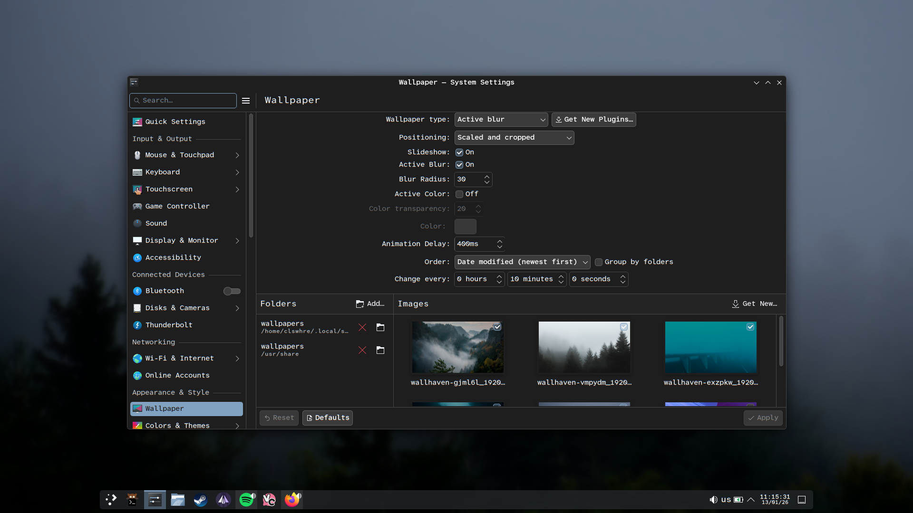
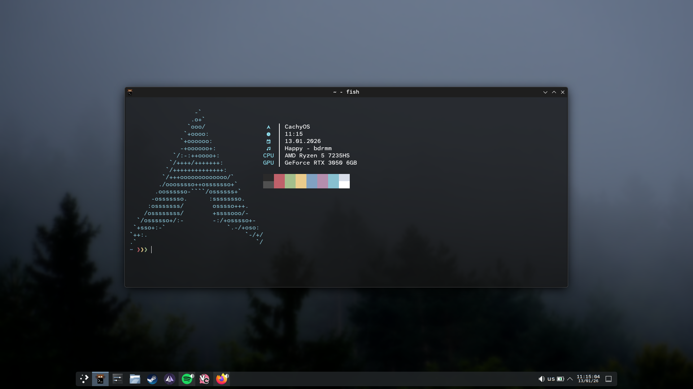

# .dotfiles

My personal configuration files for [Your OS, e.g., Arch Linux/macOS]. Managed with GNU Stow.

## 🖼️ Gallery

### Desktop & Settings


### Terminal Workflow


### Btop


## ⚙️ Configuration

| Category | Tool | Description |
| :--- | :--- | :--- |
| **OS** | Arch Linux | CachyOS Kernel |
| **WM** | Kde | Windows-like DE|
| **Shell** | Fish | With my configuration |
| **Terminal** | Kitty | GPU-accelerated terminal |
| **Editor** | Vscode | Gold standart |

## 📂 Structure

```text
.
├── assets/         # Screenshots for README
├── alacritty/      # Terminal config
├── hypr/           # Window Manager config
├── nvim/           # Neovim config
├── zsh/            # Shell config
└── README.md
