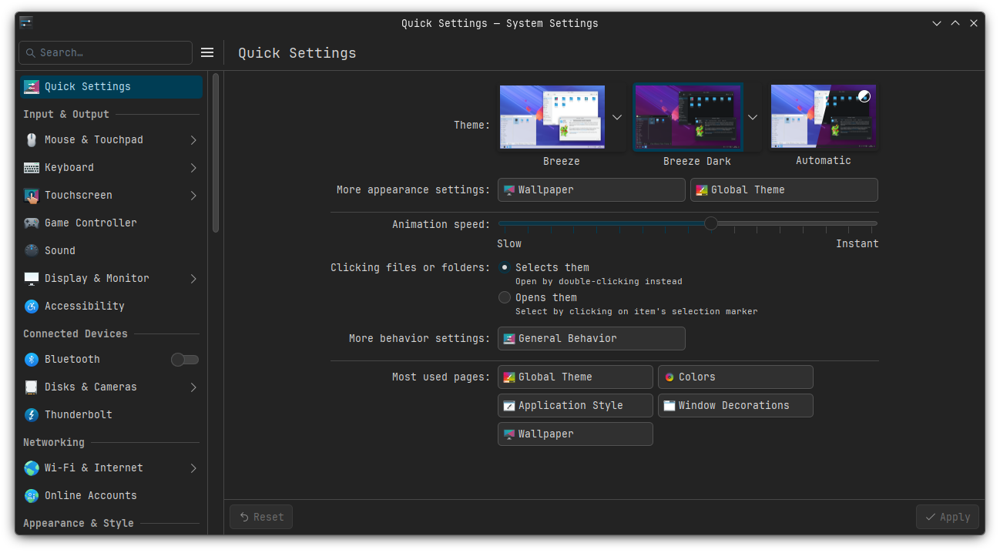
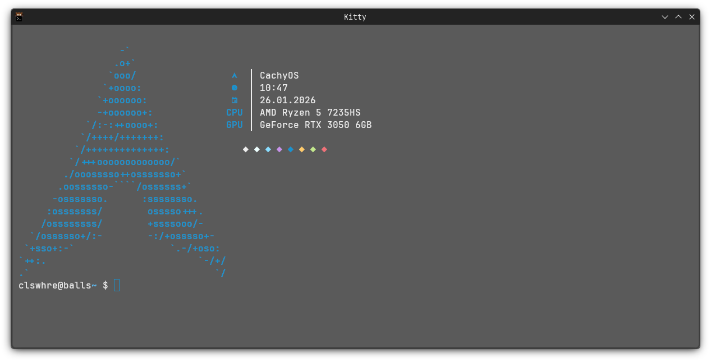
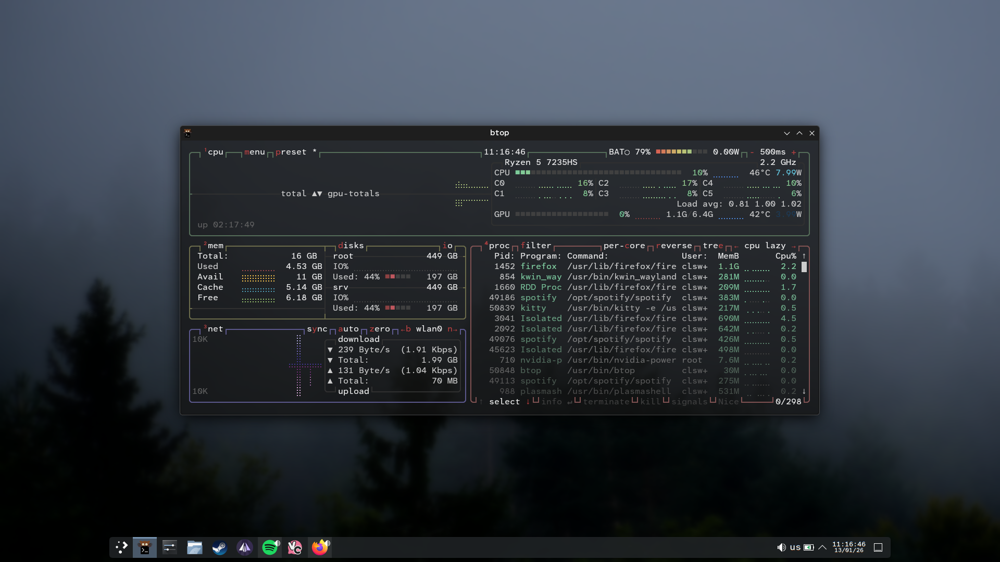

# .dotfiles

My personal configuration files for Material-like Kde, enspired by wallpapers.

## 🖼️ Gallery

### Wallpapers


### Desktop & Settings


### Terminal Workflow


### Btop



## ⚙️ Configuration

**OS:** CachyOS x86_64\
**DE:** KDE Plasma 6.5.5\
**WM:** KWin (Wayland)\
**Shell:** fish 4.3.3\
**Terminal:** Kitty 0.45.0-4.1

## 📂 Structure

```text
.
├── .config/            # Configuration files
├── assets/             # Screenshots for README
├── chrome/             # CustomCss for FireFox
├── usr/                # KDE color scheme & wallpaper
├── postinstall.txt     # Post-install tweaks
└── README.md           # README
